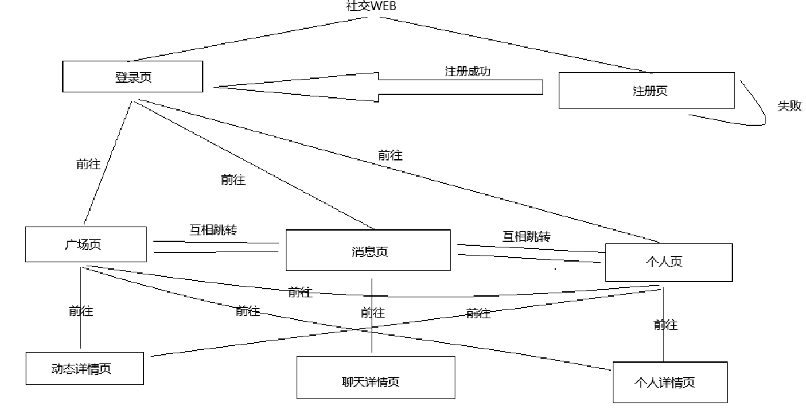
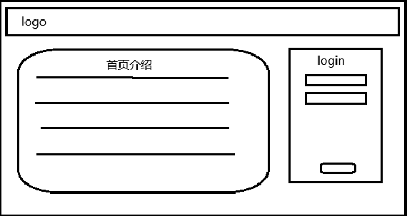
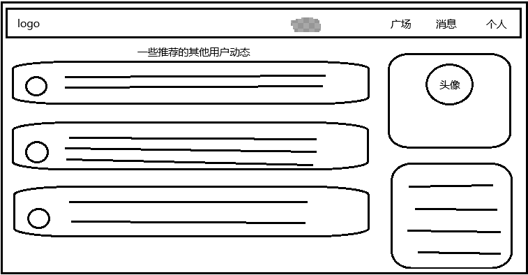
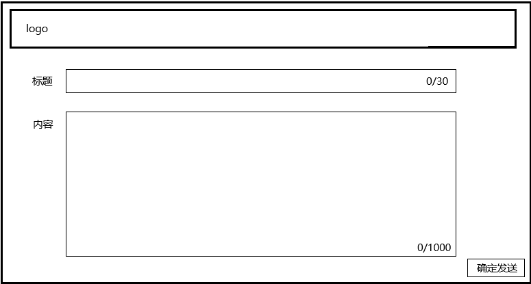
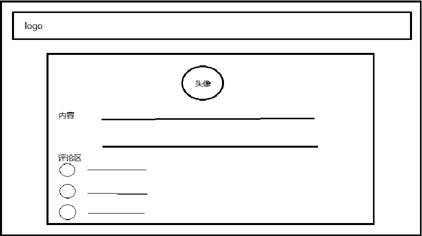
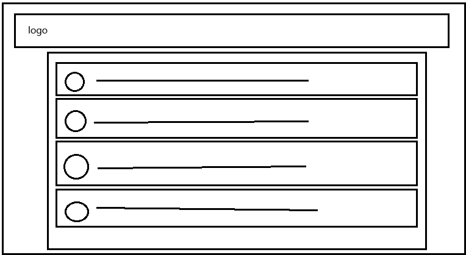
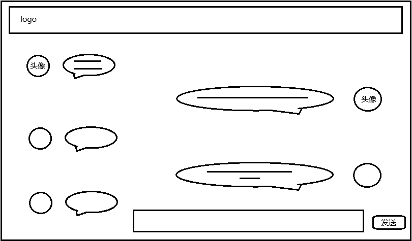
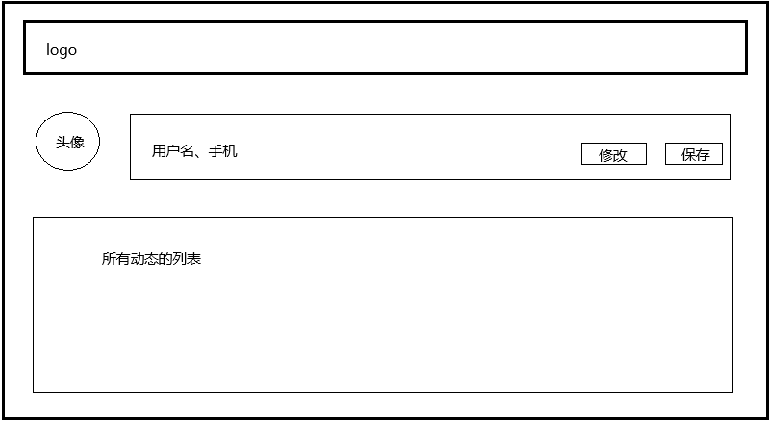

# 社交网-需求介绍

## 1、项目背景

随着互联网的普及，聊天社交网络已经几乎每个人的日常沟通交流，工作学习，娱乐互动的基本方式，每个人都希望能够在网络或者通过网络找到现实中那些不受地域限制的知心朋友。

本项目旨在构建一个操作简单，页面简介，功能明确的聊天交友社区网站，满足用户的日常聊天交友的需求，我们希望能够为用户打造一个共同进步的线上平台。

## 2、适合用户群体

- 目标用户：16-40岁的互联网活跃用户
- 核心用户：对生活充满热情和分享欲的人群

## 3、项目核心亮点

暂无

## 4、技术架构

- 前端：Vue或React，最好能够响应式兼容移动端和客户端的用户
- 后端：Express
- 数据库：Mysql
- 推荐算法：暂无
- 安全机制：暂无

## 5、项目元素

支持语言：简体中文

主题色：待UI设计稿提供

服务器：暂考虑使用本地环境和数据库

服务范围：汕头大学师生群体

LOGO：待UI设计师提供

超级管理员：暂不设置，后端直接操作数据库

## 6、项目营收手段

暂无

# 前端主页面URL

|    页面    |    地址命令     |
| :--------: | :-------------: |
|   登录页   |    xxx/login    |
|   注册页   |  xxx/register   |
|   消息页   | xxx/information |
|   个人页   |    xxx/home     |
| 社区广场页 |   xxx/ground    |
| 动态发送页 |   xxx/upload    |

！！！这里只提供主页面一级路由，二级路由开发人员可按照需求自由拼接参数和传值

# 后端配置地址

（接口文档地址待后端提供）

# UI设计图

设计师请按照下面屏幕适配来设计页面：

web端：1920px

移动端：360px

（UI设计图链接待UI设计师提供）

# 页面逻辑图

共7个页面，登录注册算一个合并，动态详情，聊天详情，个人详情都是二级路由

# 需求页面分析

| 页面           |                       草图                       | 页面逻辑                                                     |
| -------------- | :----------------------------------------------: | ------------------------------------------------------------ |
| 登录页         |  | - 用户名：允许数字和字母，特殊字符，不允许空白，位数2-10 - 密码：只能字母和数字，不允许特殊字符和空白，位数8-20 - 登录逻辑：登录成功跳转社区广场页，登录失败弹窗提醒 - 介绍文案：暂未提供留空 - 注册按钮：隐藏登录表单展示注册表单 - 忘记密码按钮：暂不实现 - 首页文案和图片暂无，前端自由发挥，好看就行 |
| 注册页         |                     （同上）                     | - 用户名：允许数字和字母，特殊字符，不允许空白位数2-10，后端需要校验，不可以出现相同的用户名 - 昵称：可以相同，校验规则按照后端模板代码 - 密码：只能字母和数字，不允许特殊字符和空白，位数8-20 - 确认密码：由前端判断 - 手机号：只允许11位数字 - 邮箱：按照后端代码模板校验 - 头像图片：支持png，jpg，大小1mb以内，前端判断大小 进行弹窗拦截 - 注册逻辑：注册成功前端隐藏注册表单，显示登录表单，注册失败前端清空表单  |
| 社区广场页     |  | **顶部导航栏** - 点击广场跳转当前页 - 点击消息跳转消息页 - 点击个人跳转个人信息页 **页面内容** - 左边为用户推荐动态栏，需要有头像，标题，内容， 发布时间，点赞数和评论数 - 右边为头像栏和一些个人信息，网站信息等等 - 点击动态跳转到动态详情页 - 点击头像跳转到个人页 - 新建动态按钮：点击跳转到动态编辑页 |
| 动态编辑页     |  | - 顶部导航栏不变 - 标题：限制30个字数 - 内容：限制1000个字数 - 提交按钮：将表单发送到后端，发送成功后跳转到社区页，然后社区页展示新发的动态 |
| 动态详情页     |  | - 顶部导航栏不变 - 页面内容展示对应用户的动态全部内容，且展示头像 - 展示用户评论区 - 点击头像可以前往对应用户的主页，评论区的头像也是 - 评论按钮：用户可以发送评论到评论区 - 在内容的上方需要展示时间，点赞数 - 在评论区上方需要展示评论数 |
| 系统消息接收页 |  | - 顶部导航栏不变 - 页面展示私聊过的或者被私聊的联系人的聊天栏，需要有对方头像，时间，和最近的一条聊天记录 - **点击聊天栏进入聊天界面** |
| 聊天页         |  | - 顶部导航栏不变 - 点击任意头像可以进入对应用户主页 - 点击发送将内容添加到页面中  |
| 个人页         |  | - 顶部导航栏不变 - 修改按钮：将展示的内容变为可改状态 - 保存按钮：将修改好的内容发送到数据库，修改的内容和注册时的表单验证规则一样，如果不符合需要有弹窗提示 - 动态列表的展示可以沿用首页的样式组件，点击可以跳转到对应的动态详情页 |

